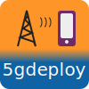

# 5G Core Deployment Helper

**5gdeploy** is a set of scripts to deploy and control 5G network.
It is primarily useful for running an emulated 5G network in Docker Compose environment.

This software is developed at the [Smart Connected Systems Division](https://www.nist.gov/ctl/smart-connected-systems-division) of the [National Institute of Standards and Technology](https://www.nist.gov/).
It is in beta stage and will continue to be updated.

## Documentation

* [installation guide](docs/INSTALL.md)
* [netdef](netdef/README.md): JSON document that defines the structure of a 5G network
* [netdef-compose](netdef-compose/README.md): CLI command to generate Compose context from NetDef
* [multi-host deployment](docs/multi-host.md)
* [traffic generators](trafficgen/README.md)
* [scenario](scenario/README.md): concrete scenarios

## Features

5G network deployment

* Define network topology, slices, subscribers in a JSON document
* Independently choose 5GCN Control Plane, 5GCN User Plane, and Radio Access Network implementations
* Generate configuration and startup scripts for supported implementations
* Deploy network functions into KVM guests
* Use both virtual and physical network interfaces to connect network functions

5G network measurement

* Perform UE registration and PDU session establishment through RAN simulators
* Launch traffic generators over PDU sessions for end-to-end network measurement
* Configure traffic impairment on the transport network
* Restrict CPU affinity for network functions

## Supported 5G implementations

5G core network - Control Plane

* free5GC
* OAI-CN5G
* Open5GS

5G core network - User Plane

* eUPF
* free5GC
* NDN-DPDK: UPF functionality supports both NDN and IPv4 traffic
* OAI-CN5G: userspace UPF, VPP-based UPF
* Open5GS

Radio Access Network

* OMEC-gNBSim: signaling-only simulator
* OpenAirInterface5G: radio simulator, over-the-air via software defined radio
* PacketRusher: protocol simulator in either signaling-only mode or PDU session mode
* srsRAN Project: radio simulator, over-the-air via software defined radio
* UERANSIM: protocol simulator with PDU sessions
