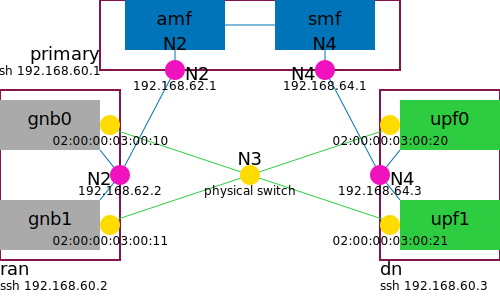

# Multi-Host Deployment

5gdeploy supports deploying a scenario over multiple host machines.
This allows a scenario to scale up and make use of more hardware resources than what a single host offers, and provides complete isolation between groups of network functions.
Most scenarios are compatible with multi-host deployment, with some scenarios strongly recommending multi-host deployment.
The README of each scenario typically contains information on how a scenario can be deployed over multiple hosts.
This page explains the basics of how multi-host deployment works and the command line flags that configure this feature.

## Primary and Secondary Hosts

In a multi-host deployment, one host is designated as *primary* and all other hosts are designated as *secondary*.
Unless otherwise noted, all 5gdeploy scripts and commands should be executed on the *primary* host.

Both the *primary* host and the *secondary* hosts can run network functions.
There's no restriction on where a network function may run.
The *primary* designation is only relevant to where to invoke (most of) the commands.

Many commands, despited being invoked on the *primary* host, need to perform actions on multiple hosts, such as starting containers.
These commands would internally connect to *secondary* hosts via SSH to perform these actions.
The [installation guide](INSTALL.md) "secondary host" section explains how to setup SSH keys to enable such control.

## How Multi-Host Deployment Works

The [netdef-compose](../netdef-compose/README.md) command supports multi-host deployment.
It generates a Compose context with multi-host deployment with these steps:

1. The 5G network, defined in either [NetDef](../netdef/README.md) format, is initially converted to a Compose context for single-host deployment.

    * This Compose file defines what network functions (i.e. containers) should be running, how they are connected to each other via Docker networks, and the IP address of each network interface.
    * You can view this Compose file if you do not specify any command line flags for multi-host deployment.
      Viewing the single-host Compose file is an important step in understanding how the scenario works and for designing the multi-host deployment.

2. If `--use-vm` command line flag is present, 5gdeploy loads a [virtualization Compose context](../virt/README.md).

    * Typical usage is `--use-vm=$HOME/compose/virt`.
    * It allows `--bridge` and `--place` command line flags to refer to virtual machines, but otherwise does not change the logic.
    * KVM guests must be running and ready for SSH connections, before generating/starting the scenario.

3. 5gdeploy processes the `--bridge` command line flags, which allow network functions on different hosts to communicate with each other.

    * If two network functions that need to communicate with each other would be running on separate hosts, you must specify a bridge to facilitate such communication.
      Otherwise, when they are placed onto different hosts, they cannot reach each other, and the 5G network will not work.
    * You can identify which network functions belong to the same Docker network by reading the single-host Compose file.
    * Establishing bridges should not change the logical network topology or IP address assignments in any way.

4. 5gdeploy processes the `--place` command line flags, which specify where to run each network function.

    * Using pattern matches, every network function (i.e. container) is placed on exactly one host.
    * The `5gdeploy.host` annotation in the Compose file indicates where a network function is being placed.

5. 5gdeploy processes CPU isolation instructions in `--place` command line flags, too.

6. The output is written as an annotated Compose file and a `compose.sh` script.

    * In the Compose file, each network function is annotated with host and CPU core assignements.
    * The `compose.sh` allows starting and stopping the Compose context at both *primary* and *secondary* hosts, invoked from the *primary* host.

## Bridges

Defining a bridge allows network functions in different hosts to communicate with each other.

5gdeploy supports two kinds of bridges:

* The **VXLAN** bridge interconnects Docker networks of the same name across multiple hosts.
  * A Docker network is created on each host.
  * Containers on each host are still attached to the Docker network, in the same way as a single-host deployment.
  * VXLAN tunnels are established to interconnect the Docker networks from multiple hosts, so that packets sent from a container on one host could reach another container attached to a Docker network with the same name on another host.
* The **Ethernet** bridge replaces the Docker network with an external physical switch.
  * The Docker network is deleted from the Compose file and would not be created on each host.
  * Each container previously on the Docker network is given either a physical Ethernet adapter or a MACVLAN sub-interface, with its own MAC address.
  * Each physical Ethernet adapter involved in an Ethernet bridge must be connected to an external physical switch.

You can mix-and-match both kinds of bridges, for different Docker networks.

5gdeploy generates bridge configuration scripts as `bridge.sh`.
They are executed in a special `bridge` container on every host netns.

The `compose.sh` script would ensure:

* The `bridge` container is started on every host machine.
* Each network function container is started on exactly one host machine.

If you want to start the containers manually, you must ensure the same condition.
The bridge configuration scripts would wait for other containers and physical Ethernet adapter to appear, and then configure the bridges.



### VXLAN Bridge

`--bridge=NETWORK,vx,IP0,IP1,...` creates a VXLAN bridge for Docker network *NETWORK*, over host IP addresses *IP0*, *IP1*, etc.
In the example diagram, there are two VXLAN bridges for N2 and N4 networks, shown in fuchsia.
They can be created with command line flags like this:

```text
--bridge=n2,vx,192.168.62.1,192.168.62.2
--bridge=n4,vx,192.168.64.1,192.168.64.3
```

Notably, each bridge command lists two IPv4 addresses, one for each host participating in the bridge, regardless of how many network functions on a host would attach to the Docker network.
Prior to starting the scenario, you must manually configure the IP addresses onto host network interfaces and bring up those interfaces.
In the IP firewall, you should allow UDP port 4789 for VXLAN communication.
If you are using VMware virtual machines, it is advised to change TX offload settings on the network interfaces used by tunnel endpoints:

```bash
sudo ethtool --offload ens160 tx-checksum-ip-generic off
```

Bridge configuration scripts will setup VXLAN bridges, such that identically named Docker networks on different hosts are connected with each other.
This is achieved by creating a VXLAN tunnel between the first host and each subsequent host, and then adding these VXLAN tunnels to the bridges representing the specified Docker network.
If there are more than two hosts in a VXLAN bridge, the first host serves as a virtual root switch and all traffic goes through it, including traffic flows between second and third hosts.
This does not change the L3 network topology in any way, but can have performance implications.

### Physical Ethernet Ports

`--bridge=NETWORK,eth,NF0=MAC0,NF1@MAC1,...` binds physical Ethernet ports to the containers.
It replaces a Docker network with a "physical" network connected to an external Ethernet switch, which could apply QoS and other policies.
In the example diagram, there are one Ethernet bridge for N3 networks, shown in yellow.
It can be created with command line flags like this:

```text
--bridge='n3,eth,gnb0=02:00:00:03:00:10,gnb1=02:00:00:03:00:11,upf0=02:00:00:03:00:20+vlan3,upf1=02:00:00:03:00:21+vlan3'
```

After "eth", each parameter consists of:

1. A [minimatch](https://www.npmjs.com/package/minimatch)-compatible pattern that selects containers attached to the Docker network.
   The patterns from all parameters in an `--bridge` flag must collectively match all containers originally attached to the Docker network.
2. Either `=` or `@` operator (see below).
3. A host interface MAC address.
4. VLAN ID (optional).
   This should be written as "+vlan" followed by an integer between 1 and 4094.

The operator indicates what kind of network interface is put into the container:

* The `=` operator moves the host interface into the container.
  * The pattern must match exactly one container.
  * The interface becomes inaccessible from the host and cannot be shared among multiple containers.
  * The original MAC address is adopted by the container.
* The `@` operator creates a MACVLAN subinterface on the host interface.
  * The pattern may match one or more containers.
  * The host interface remains accessible on the host.
  * Multiple containers may share the same host interface, where each container gets a random MAC address.
  * Currently this uses MACVLAN "bridge" mode, so that traffic between two containers on the same host interface is switched internally in the Ethernet adapter and does not appear on the external Ethernet switch.
  * This does not work if the host interface is itself a PCI Virtual Function that allows only one MAC address.

If a virtualization Compose context was loaded through `--use-vm` flag, the host interface MAC address portion can accept two additional formats:

* `vm-`*vmname*`:`*guestnetif*
  * Use KVM guest *vmname*, guest netif *guestnetif*.
  * This only works with `=` operator, because each netif in a KVM guest is a MACVTAP subinterface that does not allow additional MAC addresses.
  * If multiple containers in a KVM guest needs to use the same netif, you can create multiple guest netifs attached to the same physical host netif, and then assign one guest netif to each container.
* `vm-`*vmname*
  * Same as above, using network name (e.g. `n3`) as guest netif name.

Bridge configuration scripts will locate the host interface and invoke [pipework](https://github.com/jpetazzo/pipework) to make the move.
The specified host interface MAC address must exist on the host machine where you start the relevant network function.
Otherwise, pipework will fail with error message "no host interface matched".

When VLAN ID is specified, the host interface name should be no longer than 10 characters.
pipework will append VLAN ID after the host interface name to form the VLAN interface name, which cannot exceed 15 characters.
If this is violated, iproute2 will fail with error message "name not a valid ifname".

Per initial testing, when VLAN ID is specified:

* With `=` operator, each hostif + VLAN ID combination can only be used with a single container.
* With `@` operator, pipework completes but the containers cannot communicate.
* VLAN ID with KVM guest is untested.

## Placement

By default, if you simply run `docker compose up -d`, all network functions are started on the primary host.
`--place=PATTERN@HOST` moves network functions matching pattern *PATTERN* to the Docker host *HOST*, specified as an IP address.
If a virtualization Compose context was loaded through `--use-vm` flag, the *HOST* portion accepts `vm-`*vmname* format.
In the example diagram, gNBs and UEs are placed on *ran* host, UPFs and Data Networks are placed on *dn* host, everything else are placed on the *primary* host.
These can be specified with command line flags like this:

```text
--place="+(gnb*|ue*)@192.168.60.2"
--place="+(upf*|dn*)@192.168.60.3"
```

The patterns should be written in [minimatch](https://www.npmjs.com/package/minimatch)-compatible syntax.
They are matched in the order they are specified.
If a container name does not match any pattern, it stays on the primary host.
The `bridge` container will always run on every host.

It is your responsibility to ensure Docker networks that span multiple hosts have a bridge connecting them.
Otherwise, the 5G network probably will not work.

A `compose.sh` script is generated, which allows you to interact with the multi-host scenario:

```bash
# start the scenario on all hosts
./compose.sh up

# stop the scenario on all hosts
./compose.sh down

# execute a Docker command on the host machine of the specified network function
$(./compose.sh at CT) CMD
# example:
$(./compose.sh at ue1000) logs -f ue1000
# $(./compose.sh at CT) expands to either:
# - 'docker', if the named container is placed on the primary host
# - 'docker -H ssh://HOST', if the named container is placed on a secondary host
```

## CPU Isolation

It is possible to configure CPU isolation as part of the `--place` flag.
`--place=PATTERN@HOST(CPUSET)` allocates CPU cores in *CPUSET* on *HOST* to network functions matching pattern *PATTERN*.
To allocate CPU cores on the primary host, omit the `HOST` part and write `--place=PATTERN@(CPUSET)` only.
Example:

```text
--place="+(gnb*|ue*)@192.168.60.2(4,8-13)"
--place="upf*@192.168.60.3(4-7)"
--place="dn*@192.168.60.3(8-11)"
--place="*@(16-31)"
```

Each network function can request a specific quantity of dedicated cores.
The requested quantities are coded when integrating a 5G implementation, with some being configurable via advanced options (e.g. `--oai-upf-workers`) and others non-configurable.
They can be seen within `5gdeploy.cpus` annotation in the output Compose file.
The annotation by itself has no effect; it is only useful when the network function is matched by a `--place` flag pattern that has a cpuset.

CPU assignment is performed for each `--place` flag separately: the CPU cores in the cpuset are assigned to the group of network functions selected by the pattern.
When every network function matched in a `--place` flag is requesting dedicated cores and there are sufficient number of cores to satisfy all these requests, they will all receive dedicated cores.
If some network functions are not requesting dedicated cores, or if there aren't enough cores to satisfy all requests:

1. The first two cores in the cpuset are designated as *shared*, and all others are dedicated.
2. Requests for dedicated cores are satisfied as much as possible.
3. Network functions that do not request dedicated cores will receive the two *shared* cores.
4. Network functions that request dedicated cores but cannot be satisfied will also receive the same two *shared* cores.
   They will also gain a `5gdeploy.cpuset_warning` annotation to indicate this condition.
   If you find `5gdeploy.cpuset_warning` annotation in the Compose file, consider including more cores in the cpuset or placing network functions differently, to ensure predictable performance.

You can see a quick report of host placement and cpuset with this command:

```bash
yq -o tsv '.services | map([
  .container_name,
  (.annotations["5gdeploy.host"] | with(select(.==""); .="PRIMARY")),
  .cpuset,
  .annotations["5gdeploy.cpuset_warning"]
])' compose.yml | sort -k2,2 -k1,1 | column -t -N CONTAINER,HOST,CPUSET,CPUSET-WARNING
```
