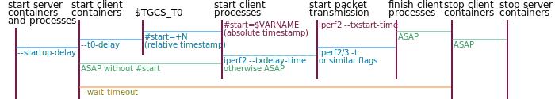

# Client-Server Traffic Generators - Advanced Usage

This page describes the advanced usage of `./compose.sh tgcs` subcommand.

## CPU Allocation

By default, traffic generator client and server containers inherit the cpuset assigned to the respective UE and DN containers.
This may cause CPU contention between traffic generator client and the UE process, as well as among traffic generator servers attached to the same DN.
It's possible to override CPU allocation with `--place=PATTERN@HOST(CPUSET)` flags, which cause containers on *HOST* whose names match *PATTERN* to be assigned with CPU cores within *CPUSET*.
For example:

```bash
./compose.sh tgcs --iperf3='internet | * | -t 60 -u -b 10M' \
  --place='*_c@(12-15)' --place='*_s@192.168.60.3(16-19)'
```

In the example, the first `--place` flag assigns cores in cpuset 12-15 to clients on the primary host, the second `--place` flag assigns cores in cpuset 16-19 to servers on the specified secondary host.
Note that the semantics of *HOST* differs from the `--place` flag in [multi-host](multi-host.md): it is a match condition here, rather than a placement instruction.

Normally, [netdef-compose](../netdef-compose/README.md) assigns a dedicated CPU core to each DN or UE container.
When you are assigning explicit cpuset to traffic generators, dedicated CPU cores become unnecessary for DN containers and for UE containers where the UE process does not participate in user plane traffic.
You can turn off these assignments with `--dn-workers=0 --phoenix-ue-isolated=NONE`.

## Independent Measurement Sets

Normally, `./compose.sh tgcs` prepares a measurement set that contains one or more traffic generators of either same or different types.
Traffic generators within a measurement set are controlled together and executed in parallel.

If you want to prepare multiple measurement sets that can be controlled independently, add `--prefix` and `--port` flags to the command line.
The `--prefix` flag determines Compose filename, container names, bash script filename, stats directory name, etc.
The `--port` flag is the starting port number used by traffic generators, which should be non-overlapping.
For example:

```bash
./compose.sh tgcs --prefix=iperf3internet --port=21000 \
  --iperf3='internet | * | -t 60 -u -b 10M' --iperf3='internet | * | -t 60 -u -b 50M -R'

./compose.sh tgcs --prefix=iperf3vehicle --port=24000 \
  --iperf3='vcam | * | -t 60 -u -b 20M' --iperf3='vctl | * | -t 60 -u -b 1M -R'

./iperf3internet.sh
./iperf3vehicle.sh
```

## Delayed Client Start

The `#start` client flag delays client start until an absolute timestamp.
This flag is translated by tgcs script and not passed to the client program.
It must be specified before other flags that do not start with `#` symbol.
This is only supported in a subset of traffic generator types, mentioned in their descriptions.

The value of `#start` client flag may be an environment variable that is resolved to an **absolute timestamp** during `PREFIX.sh` execution.
For example:

```bash
# prepare the measurement, notice the single quotes so that bash does not expand the variable
./compose.sh tgcs \
  --iperf3='internet | * | #start=$IPERF3_0_START -t 60 -u -b 10M' \
  --iperf3='internet | * | #start=$IPERF3_1_START -t 60 -u -b 10M -R'

# run the traffic generators, pass the environment variable
IPERF3_0_START="$(expr $(date -u +%s) + 30)" IPERF3_1_START="$(expr $(date -u +%s) + 45)" ./tg.sh
# if you forget to pass the environment variable, you would see warning:
#   variable is not set. Defaulting to a blank string.
```

The value of `#start` client flag may also be a **relative timestamp**, written as a `+`*t* where *t* is a floating point number.
This is resolved at runtime to be `$TGCS_T0 + `*t*, where `$TGCS_T0` is 30 seconds since starting clients (adjustable with `--t0-delay` flag).
For example:

```bash
# prepare the measurement
./compose.sh tgcs \
  --iperf3='internet | * | #start=+0  -t 60 -u -b 10M' \
  --iperf3='internet | * | #start=+15 -t 60 -u -b 10M -R'

# run the traffic generators
./tg.sh
```



Comparison with similar features:

* `--startup-delay` flag:
  * It is a top-level flag passed to tgcs.ts script.
  * It is realized as a `sleep` command in the `PREFIX.sh` bash script.
  * It allows time for the servers to become ready, but does not ensure clients start at the same time.
* `#start` flag:
  * It is passed as the first client flag in a traffic flow flag, in supported traffic generator types only.
  * It only affects traffic generator clients created by this traffic flow flag.
  * It is realized as a `sleep` command within the client container.
  * It helps ensure client programs start at the same time.
    Once they start, they will establish control connections and, generally, immediately start transmission.
* `--txstart-time` flag:
  * It is only supported in iperf2 as a client flag, which is passed to the iperf2 client program.
  * iperf2 clients will establish control connection immediately but delay transmission until the specified time.

## Reverse Direction

The `#R` client flag reverses the traffic direction by placing the client in the DN netns and the server in the UE netns.
This flag is translated by tgcs script and not passed to the client program.
It must be specified before other flags that do not start with `#` symbol.

This is supported on all [client-server traffic generators](tgcs.md) that have a separate server container per flow.
See sockperf section for an example.
If a traffic generator natively supports reverse mode (e.g. `iperf3 -r`), it's advised to use the native feature instead.

## Subcommands of Generated bash Script

Normally, you can run `PREFIX.sh` script without parameter, to execute all the steps:

```bash
./tg.sh
# this would also clear the result directory
```

The script has these steps / subcommands:

```bash
# start servers and sleep for startup-delay
./tg.sh servers

# start clients
./tg.sh clients

# wait for clients to finish
./tg.sh wait

# gather container outputs
./tg.sh collect

# delete servers and clients
./tg.sh stop

# tally overall statistics
./tg.sh stats
```
