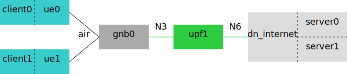

# Traffic Generators

The `compose.sh` script generated by [netdef-compose](../netdef-compose/README.md) command integrates a number of subcommands that prints traffic flow information or prepares traffic generators.
They can be invoked in a Compose context directory (e.g. `~/compose/20230601`), after the UEs have been registered and the PDU sessions have been established.

## Gather netif counters

`./compose.sh linkstat` command prints a table or writes a TSV document that lists network interface counters.
The information is gathered by executing `ip -s link show` in each container.
If a container lacks the iproute2 package, it is silently skipped.

By default, the output is an aligned textual table.
You can set `--out=FILENAME` flag to write to a TSV output file.
You can set `--out=-.tsv` flag to print the TSV document to the console.

The table shows network interfaces within each container (across all hosts, in case of a multi-host deployment).
Each row has container name, network interface name, RX packet counter, and TX packet counter.
By default, the table only includes the networks defined in the Compose file.
You can specify `--net=PATTERN` flag with a minimatch pattern to change which network interfaces are included; for example, `--net=n[369]` selects n3, n6, and n9 interfaces.
To show all network interfaces (including "lo" and PDU sessions), use `--net=ALL` flag.

Each packet counter is an accumulative value since the network interface was added.
Typically, you should run this command once before starting traffic generators, and again after stopping traffic generators, and then calculate the difference between the two counter readings on the same network interface.
Depending on the scenario topology and traffic flows you executed, it may be possible to determine whether the traffic flows were sent over the expected network interfaces, and whether packet loss has occurred either within a network function or on the network links between two network functions.

## List PDU sessions

`./compose.sh list-pdu` command prints a table or writes a TSV document that lists all established PDU sessions.
You can choose an output format with the `--out` flag, same as the `linkstat` subcommand section.

The information is gathered by executing `ip addr show` in each UE container, and then matching the interface IP addresses against UE subnets defined for Data Networks.
Any network interface that has an IP address within one of the UE subnets is considered a PDU session and included in the output.

If a UE container runs multiple UEs (other than UERANSIM), the report would be imprecise because this command cannot identify which UE owns each IP address.
For UERANSIM, the `nr-cli ps-list` command output is also taken into consideration to distinguish which UE owns each IP address.

## nmap

`./compose.sh nmap` performs nmap ping scans from Data Network to determine how many UEs are reachable.
`--dnn` flag, specified as a [minimatch](https://www.npmjs.com/package/minimatch) pattern, selects which Data Network(s) to scan.
The scanned subnet size for each Data Network is adjusted to cover all online UEs.
`--cmdout` flag saves the commands to a file instead of executing.

```bash
# scan all Data Networks
./compose.sh nmap

# scan specific Data Networks
./compose.sh nmap --dnn='internet'

# print commands instead of executing
./compose.sh nmap --cmdout=-

# save commands to file instead of executing
./compose.sh nmap --cmdout=nmap.sh
```

## Client-Server Traffic Generators

Many traffic generators have a client-server architecture, including:

* iperf3
* OWAMP and TWAMP
* netperf
* sockperf

These traffic generators are integrated with a common command structure:

```bash
./compose.sh TG-ID --prefix=PREFIX --port=PORT \
  --flow='DN-PATTERN | UE-PATTERN | CLIENT-FLAGS | SERVER-FLAGS'
```

* *TG-ID* is the identifier of the traffic generator, such as `iperf3`.
* `--prefix` flag specifies container name prefix (optional, defaults to *TG-ID*).
* `--port` flag specifies the port number used by the first traffic generator (optional, defaults to 20000).
  See iperf3 section for an example.
* `--flow` flag defines the traffic flows, described below.

The `--flow` flag is repeatable.
Each `--flow` value consists of four parts, separated by `|` character:

1. a [minimatch](https://www.npmjs.com/package/minimatch) pattern that matches a Data Network Name (DNN)
2. a minimatch pattern that matches a UE SUPI
3. a sequence of client flags
4. a sequence of server flags

The command gathers information about currently connected PDU sessions (same as `list-pdu` subcommand), matches the DNN and SUPI against the patterns in `--flow` flags, and defines a pair of client and server for each matched PDU sessions.
The client shares a netns with the UE container; the server shares a netns with the DN container.
Each `--flow` flag is processed separately, so that the same PDU session may match multiple flags and generate multiple iperf3 flows.



The command prints a brief report on the matched PDU sessions and traffic flows.
If there are fewer than expected traffic flows, please check that UEs are registered and PDU sessions have been established.

The output includes:

* Compose file `compose.PREFIX.yml`, which defines necessary iperf3 containers.
* bash script `PREFIX.sh`, which runs traffic generator containers and saves statistics in `./PREFIX` directory.
  See iperf3 section for what's contained in this script.

## iperf3

`./compose.sh iperf3` prepares throughput measurement using [iperf3](https://software.es.net/iperf/).

```bash
./compose.sh iperf3 --flow='* | * | -t 60 -u -b 10M' --flow='* | * | -t 60 -u -b 10M -R'
./iperf3.sh
```

Client flags are passed to iperf3 client.
Server flags are not accepted.

### Subcommands of Generated bash Script

Normally, you can run `iperf3.sh` script without parameter, to execute all the steps:

```bash
./iperf3.sh
```

The script has these steps / subcommands:

```bash
# start servers and sleep 5 seconds
./iperf3.sh servers

# start clients
./iperf3.sh clients

# wait for clients to finish
./iperf3.sh wait

# gather container outputs
./iperf3.sh collect

# delete servers and clients
./iperf3.sh stop

# tally overall statistics
./iperf3.sh stats
```

### Multiple Measurement Sets

To prepare multiple sets of iperf3 measurements, add `--prefix` and `--port` flags.
The `--prefix` flag determines Compose filename, container names, bash script filename, stats directory name, etc.
The `--port` flag is the starting port number used by traffic generators, which should be non-overlapping.
For example:

```bash
./compose.sh iperf3 --prefix=iperf3internet --port=21000 \
  --flow='internet | * | -t 60 -u -b 10M' --flow='internet | * | -t 60 -u -b 50M -R'
./iperf3internet.sh

./compose.sh iperf3 --prefix=iperf3vehicle --port=24000 \
  --flow='vcam | * | -t 60 -u -b 20M' --flow='vctl | * | -t 60 -u -b 1M -R'
./iperf3vehicle.sh
```

Measurement sets prepared with distinct prefixes can be controlled independently.
Starting or stopping one set would not stop other sets or overwrite each other's files.

### iperf3 Text Output

If you want iperf3 text output instead of JSON output, change `./compose.sh iperf3` to `./compose.sh iperf3t`.

```bash
./compose.sh iperf3t --flow='* | * | -t 60 -u -b 10M' --flow='* | * | -t 60 -u -b 10M -R'
./iperf3t.sh
```

The text outputs of each iperf3 container are saved in `./iperf3t` directory, but the script cannot gather overall statistics.

## OWAMP and TWAMP

`./compose.sh owamp` prepares one-way latency measurement using [OWAMP](https://software.internet2.edu/owamp/).
`./compose.sh twamp` prepares two-way latency measurement using [TWAMP](https://datatracker.ietf.org/doc/html/rfc5357).

```bash
./compose.sh owamp --flow='internet | * | -L 3.0 -s 900' --flow='vcam | * | -t' --flow='vctl | * | -f'
./owamp.sh

./compose.sh twamp --flow='internet | * | -L 3.0 -s 900 -v'
./twamp.sh
```

Client flags are passed to [owping](https://software.internet2.edu/owamp/owping.man.html) or twping.
Server flags are not accepted.

### Session File

You can pass flags to owping/twping within the third part of `--flow` flag.
`-F` and `-T` flags are handled specially: the filename that follows either flag is ignored; instead, it is set to a file in `~/compose/20230601/owamp` directory.

OWAMP session files can be further analyzed with `owstats` command.

```bash
./compose.sh owamp --port=21000 --flow='internet | *1000 | -F x -T x'
./owamp.sh

alias owstats='docker run --rm --mount type=bind,source=$(pwd),target=/data,readonly=true -w /data perfsonar/tools owstats'
owstats -R ./owamp/21000-F.owp
owstats -R ./owamp/21000-T.owp
```

There isn't a tool to analyze TWAMP session files.
To see the raw output, it's advised to pass either `-R` or `-v` flag to twping.

## Netperf

`./compose.sh netperf` prepares a [netperf](https://hewlettpackard.github.io/netperf/doc/netperf.html) benchmark.

```bash
./compose.sh netperf --flow='internet | * | -t OMNI -j -- -T UDP -d send -o all'
./netperf.sh
```

Client flags are passed to `netperf`.
Server flags are passed to `netserver`.

The script cannot identify the traffic direction of each flow in the brief report.
The script cannot gather summary information from the output.

## Sockperf

`./compose.sh sockperf` prepares a [sockperf](https://manpages.ubuntu.com/manpages/jammy/man1/sockperf.1.html) benchmark.

```bash
./compose.sh sockperf --flow='internet | * | under-load --full-log x --full-rtt -t 30 -m 800 -b 1 --reply-every 1 --mps 1000 | -g'
./sockperf.sh
```

Client flags, starting with a subcommand such as `under-load`, are passed to `sockperf`.
Server flags are passed to `sockperf server`.

Similar to OWAMP, the filename that follows `--full-log` is set to a file in `~/compose/20230601/sockperf` directory, which can be analyzed later.

The script cannot gather summary information from the output.
