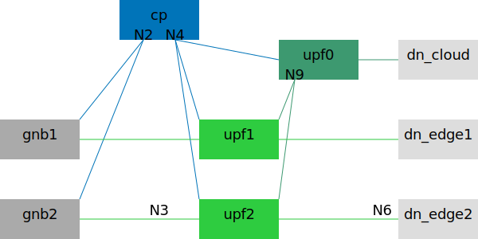

# Cloud and Edges

## Description

There is one *cloud* host and two *edge* hosts.
The *cloud* host runs the CP and the *cloud* data network.
Each *edge* host runs a gNB and an *edge* data network.

There are two UEs on each *edge* host.
They can access both the *cloud* data network and the local *edge* data network.
They cannot access other *edge* data networks.



## Preparation

You need three hosts: *cloud* (primary), *edge1*, *edge2*.
All commands shall be invoked on the *cloud* host.

Define variables for SSH hostnames or IPs:

```bash
CTRL_EDGE1=edge1
CTRL_EDGE2=edge2
```

Define variables for experiment network IPs:

```bash
EXP_CLOUD=192.168.60.10
EXP_EDGE1=192.168.60.11
EXP_EDGE2=192.168.60.12
```

## Basic Usage

Generate Compose file:

```bash
cd ~/5gdeploy/scenario
./generate.sh 20230510 \
  --cp=phoenix --up=phoenix --ran=phoenix \
  --bridge="n2 | vx | ${EXP_CLOUD},${EXP_EDGE1},${EXP_EDGE2}" \
  --bridge="n4 | vx | ${EXP_CLOUD},${EXP_EDGE1},${EXP_EDGE2}" \
  --bridge="n9 | vx | ${EXP_CLOUD},${EXP_EDGE1},${EXP_EDGE2}"
```

The Compose context is created at `~/compose/20230510`.
See [scenario general README](../README.md) on how to interact with the Compose context.

This scenario uses N9 interface that is only supported in Open5GCore UPF.
