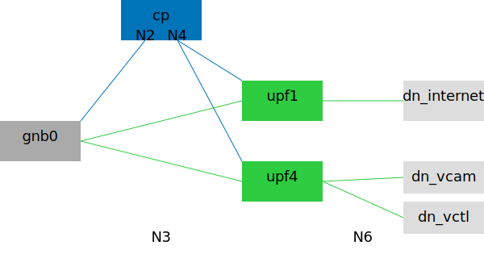

# Phones and Vehicles, 2-Slice with 2 UPFs

## Description

There are two slices and three Data Networks:

* sst=1, sd=0x000000, dnn=internet: generic cellphone, `10.1.0.0/16`.
* sst=4, sd=0x000000, dnn=vcam: remote driving camera stream, `10.140.0.0/16`.
* sst=4, sd=0x000000, dnn=vctl: remote driving control stream, `10.141.0.0/16`.

Each slice is served by a dedicated UPF, while Data Networks on the same slice share the same UPF.
All control plane network functions are shared.

There are 6 phones and 2 vehicles, sharing 1 gNB.
These quantities can be adjusted via command line flags.



## Basic Usage

Generate Compose file:

```bash
cd ~/5gdeploy/scenario
./generate.sh 20231017
# Add --up=free5gc to select free5GC UPF instead of Open5GCore UPF.
# Add --ran=ueransim to select UERANSIM gNB+UE instead of Open5GCore gNB+UE.

# adjust gNB and UE quantities
./generate.sh 20231017 +gnbs=2 +phones=12 +vehicles=6
# UERANSIM is recommended if large UE quantity is desired.
```

The Compose context is created at `~/compose/20231017`.
See [scenario general README](../README.md) on how to interact with the Compose context, including how to establish PDU sessions from Open5GCore UE simulators.

## Traffic Generation

See [trafficgen](../20230817/trafficgen.md) for suggestions on how to generate traffic in this scenario.

## Multi-Host Usage

In this sample, we use three physical/virtual machines, each running these services:

* *primary*: Control Plane, gNB and UE simulators.
* *upf1*: UPF1, Data Network `internet`.
* *upf4*: UPF4, Data Network `vcam`, Data Network `vctl`.

Each machine shall have two network interfaces apart from the control interface.

* `CTRL_*` variables define the control interface IP addresses, for SSH usage.
* `CPUSET_*` variables define a list of CPU cores on each host for CPU isolation.
  * To disable CPU isolation, set them to empty strings.
* `N3_*` variables define MAC addresses for N3 network of relevant network functions.
  * QoS rules may be applied on the hardware switch connected to these interfaces.
* `N4_*` variables define MAC addresses for N4 network of relevant network functions.

```bash
# define variables for network interfaces
CTRL_UPF1=192.168.60.2
CTRL_UPF4=192.168.60.3
CPUSET_PRIMARY="(2-11)"
CPUSET_UPF1="(2-11)"
CPUSET_UPF4="(2-11)"
N3_GNB0=02:00:00:03:00:01
N3_UPF1=02:00:00:03:00:02
N3_UPF4=02:00:00:03:00:03
N4_SMF=02:00:00:04:00:01
N4_UPF1=02:00:00:04:00:02
N4_UPF4=02:00:00:04:00:03

# generate Compose file
./generate.sh 20231017 \
  --bridge=n3,eth,gnb0=$N3_GNB0,upf1=$N3_UPF1,upf4=$N3_UPF4 \
  --bridge=n4,eth,smf=$N4_SMF,upf1=$N4_UPF1,upf4=$N4_UPF4 \
  --place="+(upf1|dn_internet)@$CTRL_UPF1$CPUSET_UPF1" \
  --place="+(upf4|dn_v*)@$CTRL_UPF4$CPUSET_UPF4" \
  --place="*@$CPUSET_PRIMARY"

# upload Compose file and config folder to secondary hosts
../upload.sh ~/compose/20231017 $CTRL_UPF1 $CTRL_UPF4

# start the scenario
~/compose/20231017/compose.sh up

# stop the scenario
~/compose/20231017/compose.sh down
```

This scenario has 1 gNB by default.
If you change gNB quantity in `+gnbs=` flag, you must also edit `--bridge=n3,eth,` flag, so that each gNB has its own N3 network interface.
gNB does not use N4 network, so that `--bridge=n4,eth,` flag can remain unchanged.

## SONiC Switch QoS Setting

This scenario supports QoS enforcement when the N3 network is on a [SONiC](https://github.com/sonic-net/SONiC) Ethernet switch, for downlink direction only.

`sonic-dl.ts` generates downlink QoS configuration.
Sample commands:

```bash
# view help
$(corepack pnpm bin)/tsx 20231017/sonic-dl.ts --help

# configure downlink QoS
$(corepack pnpm bin)/tsx 20231017/sonic-dl.ts --format=shell \
  --gnb=Ethernet8 --upf1=Ethernet0 --upf4=Ethernet1 \
  --rate=1000 --sched=DWRR --w1=20 --w4=80
```

Traffic classification is based on ingress switchport:

* Packets from UPF1 are assigned TC 1 (low priority).
* Packets from UPF4 are assigned TC 0 (high priority).
