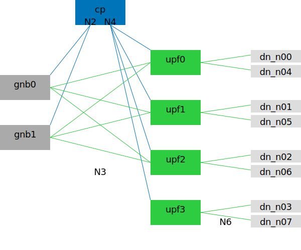

# Many Slices

## Description

This scenario allows defining large quantity of slices and Data Networks.
There are topology parameters for adjusting Data Networks, UPF, and gNB quantity.



## Basic Usage

Generate Compose file:

```bash
cd ~/5gdeploy/scenario

# free5GC+UERANSIM
./generate.sh 20240129 +dn=8 +upf=4 +gnb=2 --cp=free5gc --up=free5gc --ran=ueransim

# Open5GCore
./generate.sh 20240129 +dn=8 +upf=4 +gnb=2 +same-snssai=true --cp=phoenix --up=phoenix --ran=phoenix
```

The Compose context is created at `~/compose/20240129`.
See [scenario general README](../README.md) on how to interact with the Compose context, including how to establish PDU sessions from Open5GCore UE simulators.

### Data Networks and UPFs

The `+dn` and `+upfs` flags specify the quantity of Data Networks and UPFs.
You can set up to 99 DNs and up to 8 UPFs; however, initial tests indicate that several 5G implementations start to misbehave when more than 36~50 DNs are defined.
Data Networks are evenly distributed among defined UPFs.
Typically, DN quantity should be no less than UPF quantity, otherwise some UPFs would not receive any traffic.

UPFs are named alphabetically.
Each Data Network Name starts with the connected UPF name, followed by a sequentially assigned number.

The `+same-snssai` flag specifies S-NSSAI assignment:

* `+same-snssai=false` (default) assigns a distinct S-NSSAI to every Data Network.
* `+same-snssai=true` assigns the same S-NSSAI to all Data Networks.
  * This is necessary for `--ran=phoenix`, which only supports no more than 2 distinct S-NSSAIs.

### gNBs and UEs

The `+gnb` flag specifies gNB quantity.
Each gNB comes with minimal quantity of UEs such that all UEs behind each gNB collectively establishes one PDU session toward each DN.

Each UE can have a maximum of 15 PDU sessions.
This can be decreased with `+dn-per-ue` flag.
For example, if the UE simulator supports only 1 PDU session, you can specify `+dn-per-ue=1`.
Note that PacketRusher has a limitation of only 1 PDU session per gNB (not per UE) and will not work with this scenario.

## Multi-Host Usage

In this sample, we define a topology with 2 gNBs, 4 UPFs, and 8 Data Networks.
They are deployed on 3 hosts:

* *primary*: Control Plane, gNB and UE simulators.
* *ab*: `upf_a`, `upf_b`, associated Data Networks.
* *cd*: `upf_c`, `upf_d`, associated Data Networks.

There are two network interfaces available for experiments on each host, used for N3 and N4 networks respectively.
This means, some network interfaces would be shared between two network functions (containers).

host    | netif | used by
--------|-------|---------------
primary | N3    | gnb0, gnb1
primary | N4    | smf
ab      | N3    | upf\_a, upf\_b
ab      | N4    | upf\_a, upf\_b
cd      | N3    | upf\_c, upf\_d
cd      | N4    | upf\_c, upf\_d

This is just one of many possible setups.
Other setups are possible, including more netif sharing or fewer netif sharing.
Read [multi-host](../../docs/multi-host.md) for explanation about `--bridge` and `--place` flags.

### VXLAN Bridges

These commands create a Compose context using VXLAN bridges:

```bash
# define variables
CTRL_AB=192.168.164.47
CTRL_CD=192.168.164.46
CPUSET_PRIMARY="(4-31)"
CPUSET_AB="(4-15)"
CPUSET_CD="(4-15)"
N3_PRIMARY=10.141.7.3
N3_AB=10.141.7.4
N3_CD=10.141.7.5
N4_PRIMARY=10.141.7.3
N4_AB=10.141.7.4
N4_CD=10.141.7.5

# generate Compose context
./generate.sh 20240129 +dn=8 +upf=4 +gnb=2 +same-snssai=true --cp=phoenix --up=phoenix --ran=phoenix \
  --bridge=n3,vx,$N3_PRIMARY,$N3_AB,$N3_CD \
  --bridge=n4,vx,$N4_PRIMARY,$N4_AB,$N4_CD \
  --place="+(upf|dn)_[ab]*@$CTRL_AB$CPUSET_AB" \
  --place="+(upf|dn)_[cd]*@$CTRL_CD$CPUSET_CD" \
  --place="*@$CPUSET_PRIMARY"

# upload to secondary hosts
../upload.sh ~/compose/20240129 $CTRL_AB $CTRL_CD
```

Explanation and variations:

* First and second `--place` flags place UPF and DN containers onto *secondary* hosts, assigning dedicated CPU cores if applicable.
* Last `--place` flags keep the remaining containers (i.e. control plane and RAN simulators) on the *primary* host, but assigns dedicated CPU cores if applicable.
* Each `--bridge` flag creates a VXLAN bridge, interconnecting N3 and N4 networks on all three hosts.
  Notice that the container names are not listed in these lines, only the host IPs.
* You must assign the IP addresses in `N3_*` and `N4_*` variables to the physical network interfaces on each host, prior to starting the Compose context.
* If you have only one network interface for experiment on each host, you can reuse the same IP addresses in `N3_*` and `N4_*` variables.
  The VXLAN bridges would stay isolated because they would have different VNI.
* If you have only one network interface for both control and experiment on each host, you can reuse the control IP addresses in `N3_*` and `N4_*` variables too.
  Having VXLAN bridge(s) does not affect other traffic using the same interface and would not unassign these IP addresses.

### Ethernet Bridges with MACVLAN

MACVLAN procedure is in development.

## Traffic Generation

Count how many UEs are connected:

```bash
jq -r '.dataNetworks[] | (
  "$(./compose.sh at dn_" + .dnn + ") exec dn_" + .dnn +
  " nmap -sn " + (.subnet|split("/")[0]) + "/24"
)' netdef.json | bash -x
```

It is expected that each `nmap` reports that *U* hosts are up, where *U* equals gNB quantity.
This is because there should be exactly one UE attached to each gNB that has a PDU session to each Data Network.

iperf3 procedure is in development.
